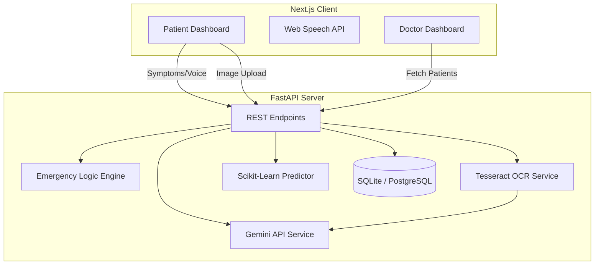

# AI-Powered Multilingual Healthcare Decision Support System

> **Disclaimer**: *This system is built for educational and decision-support purposes only. It is not intended to replace professional medical diagnosis, advice, or treatment.*

## Overview
This is a full-stack, enterprise-grade AI healthcare platform designed to assist in preliminary symptom analysis, detect emergency risks, and interpret medical reports using OCR and Large Language Models. It is specifically designed with an accessible, multilingual UI for deployment in low-resource or rural areas.

This project is structured as a **Major Final Year Project**, demonstrating integration of Machine Learning, OCR, Generative AI, and modern web architectures.

## Architecture

## Features
1. **AI Symptom Predictor:** Users input symptoms (via text or voice), and an ML model predicts potential diseases with a confidence score.
2. **Emergency Severity Engine:** Rule-based logic flags dangerous combinations (e.g., chest pain + shortness of breath) and triggers immediate "Seek Medical Attention" alerts.
3. **Multilingual Voice Input:** Built-in Speech-to-Text supporting English, Hindi, and Marathi.
4. **OCR Medical Report Analysis:** Upload a blood report image, extract the text using `pytesseract`, and summarize the results in simple language using the Gemini API.
5. **Doctor Dashboard:** A secure view for medical professionals to monitor patient histories and AI alerts.

## Technical Stack
* **Frontend:** Next.js (React), Tailwind CSS, Glassmorphism UI
* **Backend:** FastAPI (Python), SQLAlchemy
* **Database:** SQLite (dev) / PostgreSQL (prod)
* **Machine Learning:** Scikit-Learn, Pandas
* **AI/OCR:** Tesseract OCR, Google Gemini API

## Machine Learning Pipeline

### 1. Dataset & Preprocessing
The model is trained on a symptom-disease dataset (e.g., Kaggle Disease Symptom Prediction dataset).
* **Feature Extraction:** Symptoms are one-hot encoded into binary vectors (1 if present, 0 if not).
* **Labeling:** Target variable is the specific disease class.
* **Splitting:** Data is split 80/20 for training and testing using `train_test_split`.

### 2. Model Training
* A **Random Forest Classifier** is used for its robustness against overfitting and ability to handle numerous binary features effectively.
* `n_estimators=100` are utilized to create a strong ensemble prediction.

### 3. Evaluation
* The model is evaluated using the `accuracy_score` metric.
* Feature importance can be derived from the Random Forest to explain *why* the model made a certain prediction (explainable AI).
* The trained model and feature names are serialized into a `.joblib` file for lightning-fast inference in the FastAPI backend.

## Setup & Installation

### Backend Setup
1. `cd backend`
2. `python -m venv venv`
3. `.\venv\Scripts\activate` (Windows) or `source venv/bin/activate` (Mac/Linux)
4. `pip install fastapi uvicorn sqlalchemy pytesseract scikit-learn pandas requests`
5. *Train the model:* `python ml_models/train.py`
6. *Run the server:* `uvicorn main:app --reload`

### Frontend Setup
1. `cd frontend`
2. `npm install`
3. `npm run dev`

### API Keys
Ensure you have set the `GEMINI_API_KEY` in your backend environment to enable the LLM Report summarization.
